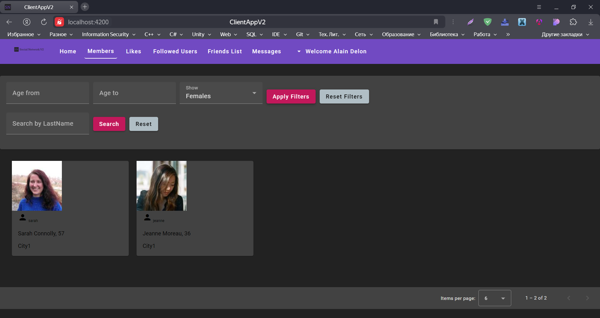

# SocialNetwork





Welcome to the SocialNetwork project, a comprehensive social networking application developed using a N-Layered Architecture and Angular for the frontend.

## Technology Stack
1. Backend Architecture: The backend of our application is structured using a N-Layered Architecture, ensuring a clean separation of concerns and a maintainable codebase.

2. Frontend Framework: Angular, a robust platform for building web applications, is used for the frontend. It allows us to structure our codebase in a modular and maintainable manner.

3. UI Components: For the user interface, we have chosen Angular Material. It's a UI component library that adheres to Material Design principles and offers a wide array of ready-to-use components.

4. Caching: Redis, an open-source in-memory data structure store, is used for caching. It serves as a database, cache, and message broker.


## Running the Application

To run this project, you need to create an appsettings.json file in the WebAPI section with the following structure:

```
{
  "Logging": {
    "LogLevel": {
      "Default": "Information",
      "Microsoft.AspNetCore": "Warning"
    }
  },
  "AllowedHosts": "*",
  "ConnectionStrings": {
    "DefaultConnection": "<.....>",
    "Redis": "localhost"
  },
  "Token": {
    "Key": "<......>",
    "Issuer": "<......>"
  },
  "CloudinarySettings": {
    "CloudName": "<.....>",
    "ApiKey": "<.....>",
    "ApiSecret": "<.....>"
  },
  "Authentication": {
    "Google": {
      "ClientId": "<.....>",,
      "ClientSecret": "<.....>"
    }
  }
}
```
Replace "<Example>" with your actual data respectively.

To run the application, Docker must be installed on your machine. Docker is used to run Redis and Redis Commander.

Here's our docker-compose.yml file for running the services:

```yaml
services:
  redis:
    image: redis:latest
    ports:
      - 6379:6379
    command: ["redis-server", "--appendonly", "yes"]
    volumes:
      - redis-data:/data

  redis-commander:
    image: rediscommander/redis-commander:latest
    environment:
      - REDIS_HOSTS=local:redis:6379
      - HTTP_USER=root
      - HTTP_PASSWORD=secret
    ports:
      - 8081:8081
    depends_on:
      - redis

volumes:
  redis-data:
  ```

To start the services, navigate to the directory containing the docker-compose.yml file and execute the following command: docker-compose up

## Usage
The SocialNetwork application provides a variety of features that allow users to interact and connect with each other. Here's how you can use the application:

1. Registration: To start using the application, you first need to register.

2. Login: If you already have an account, click on the 'Login' button on the homepage.

3. Browse Users: You can browse other users on the platform. Visit their profiles to learn more about them.

4. Follow Users: If you find interesting users, you can follow them to get their updates.

5. Send Friend Requests: You can send friend requests to other users.

6. Send Messages: You can send private messages to other users.

7. Like Users: If you like an user, show your appreciation by clicking on the 'Like' button.

8. Rate Photos: You can rate photos posted by other users.

9. This application also supports Google authentication. To use this feature, you need to set up a project in the Google Cloud Console, enable the Google+ API, and obtain the client ID and client secret.

## For Administrator Privileges
Email: admin.example@outlook.com

Password: Pa$$w0rd!

## Contributing
Contributions are welcome. Please fork the repository and create a pull request with your changes.

## Author

Bohdan Harabadzhyu

## License

[MIT](https://choosealicense.com/licenses/mit/)

